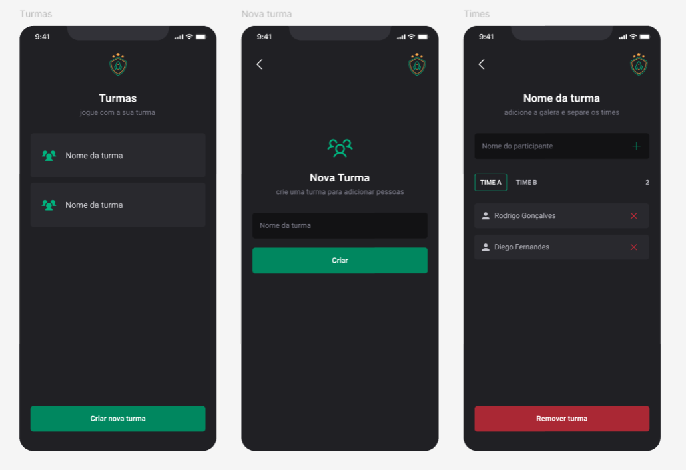

<p align="center">
  <h1 align="center">IgniteTeams - React Native 👥</h1>
</p>

<p align="center" margin-top="25px">
  
  
</p>

**IgniteTeams** é um aplicativo desenvolvido com **React Native** e **Expo** que permite aos usuários criar times e cadastrar pessoas para jogar seus jogos favoritos. O armazenamento dos dados é feito localmente no dispositivo utilizando **AsyncStorage**.

## Funcionalidades

- Criar times personalizados.
- Adicionar jogadores a cada time.
- Gerenciar os jogadores cadastrados.
- Armazenamento local dos dados para acesso offline.

___

## 🎨 Layout
Imagens da aplicação são vistas na imagem abaixo:



___

## 🛠 Tecnologias

As seguintes tecnologias foram empregadas na criação deste projeto:

- [React Native](https://reactnative.dev/)
- [TypeScript](https://www.typescriptlang.org/)
- [Async Storage](https://react-native-async-storage.github.io/async-storage/)
- [Phosphor Icons](https://phosphoricons.com/)
- [Expo Vector Icons](https://docs.expo.dev/guides/icons/)

___

## 🚀 Como utilizar

Clone o projeto para o local desejado em seu computador.

```bash
$ git clone https://github.com/Brunogodoy2911/IgniteTeams

# Navegue até o diretório
$ cd IgniteTeams

# Instale as dependências necessárias
$ npm install

# Agora inicie a aplicação - Um QR Code será exibido no Terminal
$ npx expo start

# Em seu celular, instale o aplicativo Expo Go - Ele é gratuito na Play Store.

# Abra o Expo Go que acabou de instalar, e então escaneie o QR Code através do aplicativo.

# A aplicação então será exibida de forma 100% funcional diretamente em seu celular.

Made with ❤️ by Bruno Henrique de Godoy 👋🏽 [Get in Touch!](https://www.linkedin.com/in/bruno-godoy-07806726b/)
